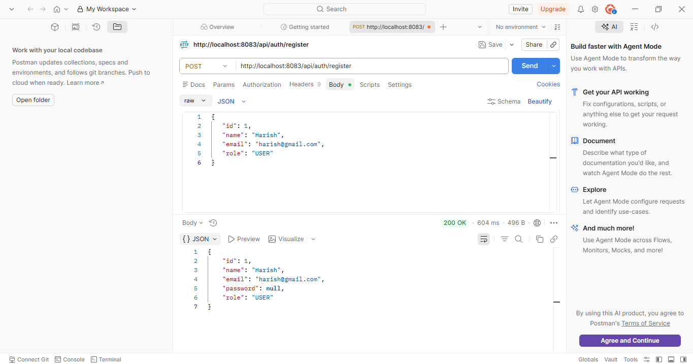
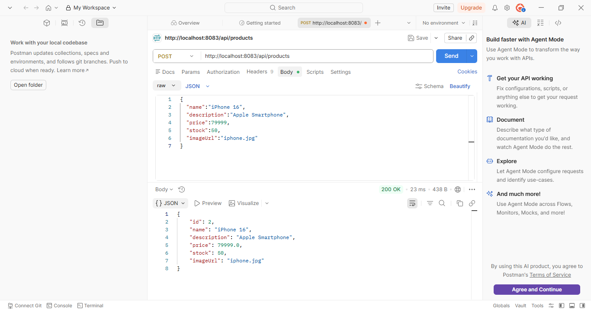
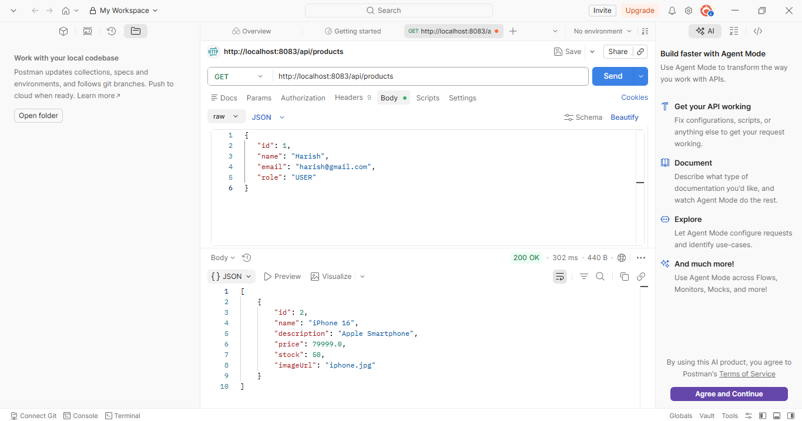
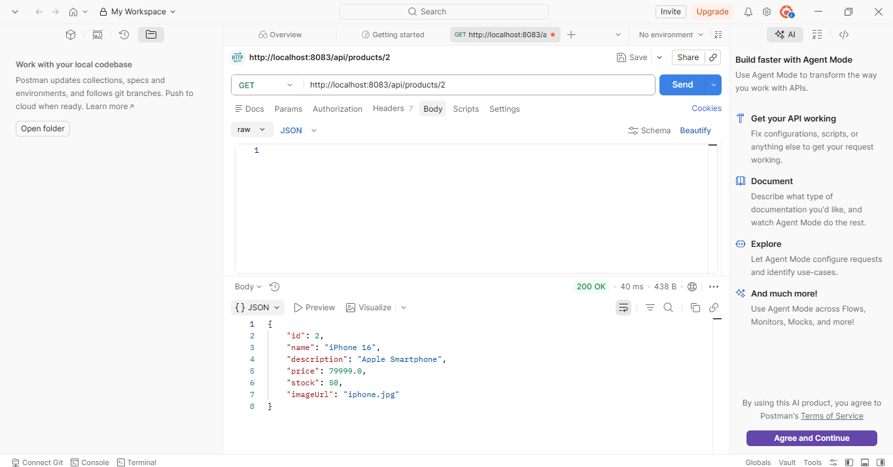
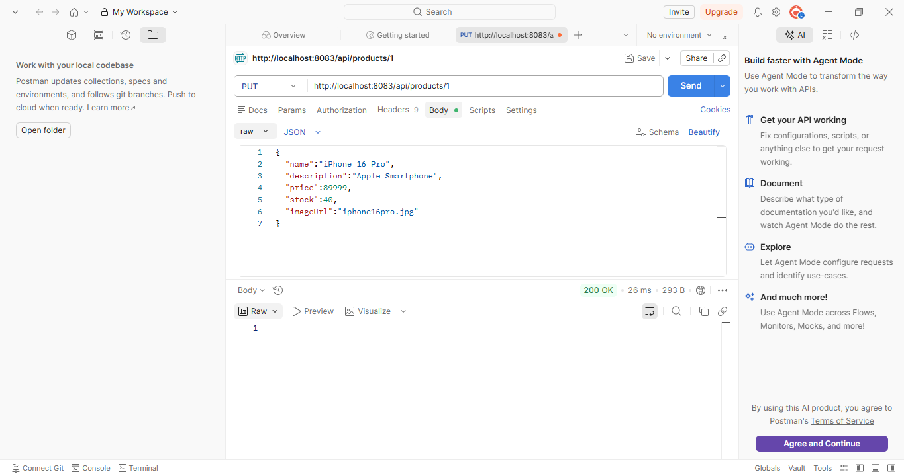
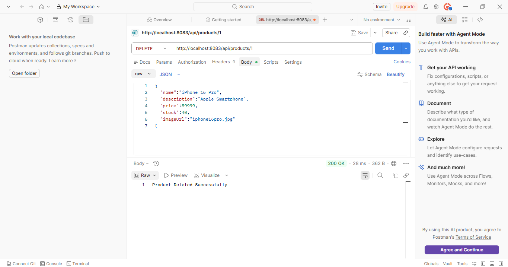
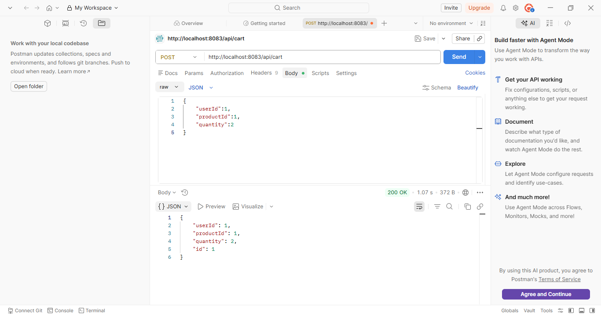
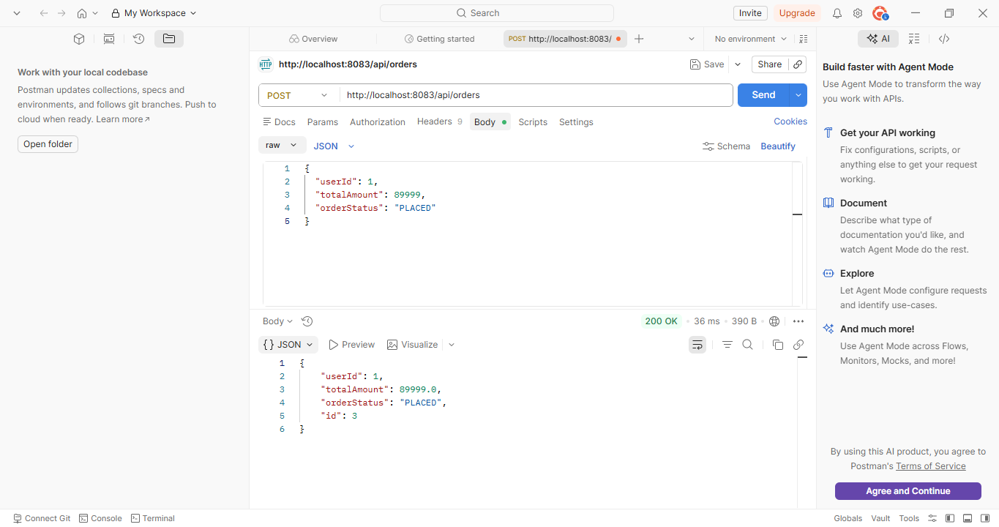

# E-Commerce Backend API

A Spring Boot REST API for an E-Commerce platform.

## Features

✅ User Registration

✅ Product CRUD Operations

✅ Shopping Cart Management

✅ Order Placement

✅ Spring Security Integration

✅ MySQL Database Integration

✅ RESTful API Architecture

## Project Structure

src/main/java/com/ecommerce/ecommerce

├── controller

├── service

├── repository

├── model

├── security

## Tech Stack

- Java 17
- Spring Boot
- Spring Data JPA
- Spring Security
- MySQL
- Maven
- Postman

## API Endpoints

### User APIs
- POST /api/auth/register

### Product APIs
- POST /api/products
- GET /api/products
- GET /api/products/{id}
- PUT /api/products/{id}
- DELETE /api/products/{id}

### Cart APIs
- POST /api/cart

### Order APIs
- POST /api/orders

## Screenshots

### User Registration

### Create Product

### Get Products

### Get Product By ID

### Update Product

### Delete Product

### Add To Cart

### Place Order

